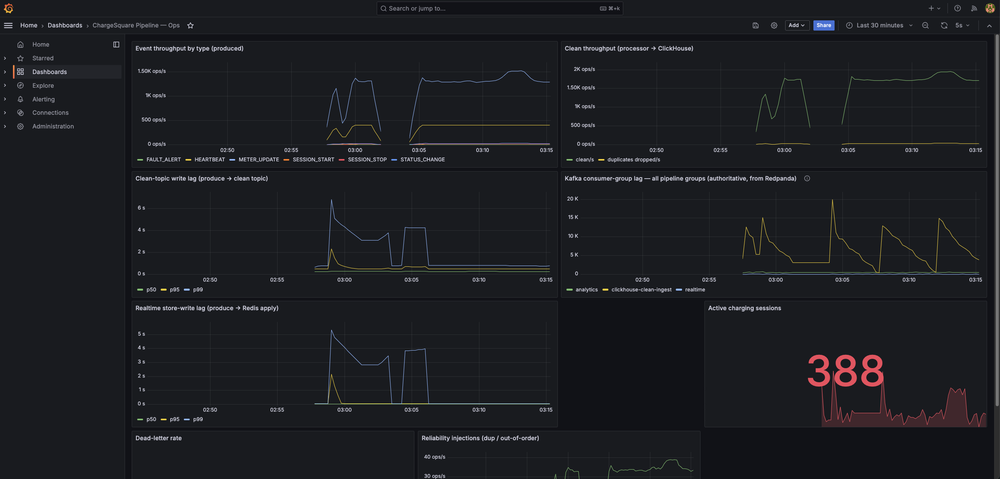
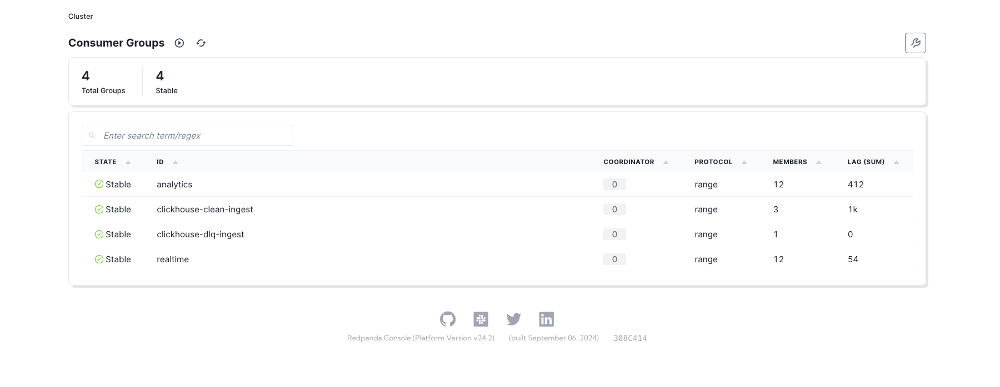
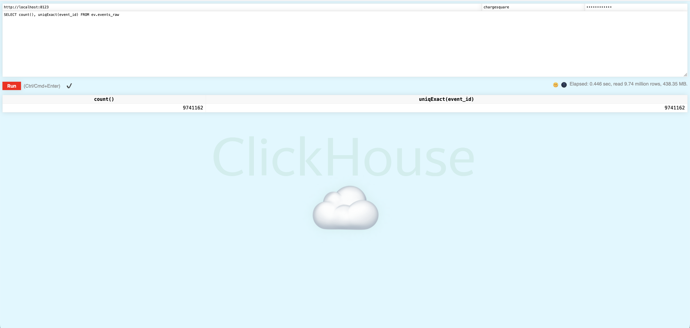
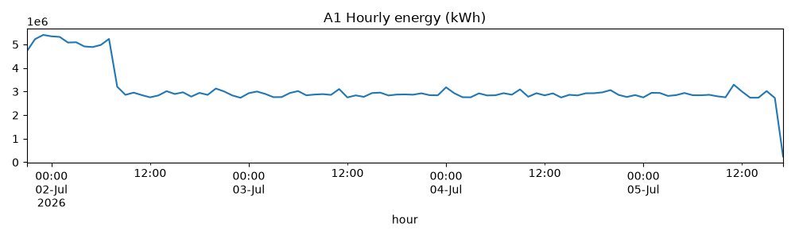

# ChargeSquare (EV Charging Data Pipeline)

[](https://github.com/BoraKaraman1/Data-Engineering-Case-Study/actions/workflows/ci.yml)

Real-time + analytics pipeline for EV charging telemetry: a Go simulator produces a
realistic charging-event firehose into Kafka; a Go processor (validate → dedup →
route) feeds a Redis current-state store and a ClickHouse analytics store;
PostgreSQL holds the station/tariff registry; Prometheus + Grafana observe the lot.

```
                                  ┌──────────────► Redis  (current state, <100ms point reads)
                                  │                 (realtime consumer group)
 simulator ──► Kafka (raw) ──► processor
   (Go)        Redpanda          (Go)  ──► Kafka (clean) ──► ClickHouse  (analytics, OLAP)
                  │               │                            (Kafka engine → ReplacingMergeTree → revenue MV)
                  │               └──► Kafka (dlq) ──────────► ClickHouse.dead_letter
                  │
 PostgreSQL ◄─────┘ station/tariff registry (OLTP source of truth; loaded into memory, refreshed periodically)

 Prometheus scrapes simulator + processor  →  Grafana dashboards
```

Full rationale (store selection, dedup, late/out-of-order, partitioning, the energy
double-count trap, path to production) is in **[docs/ARCHITECTURE.md](docs/ARCHITECTURE.md)**.

**Start here: [docs/ARCHITECTURE.md](docs/ARCHITECTURE.md)** for the final report tying the
whole pipeline together (design decisions, the measured scale curve, production path).

**How it was hardened: [docs/REVIEW_LOG.md](docs/REVIEW_LOG.md)** documents every finding from six
independent code-review rounds (33 in all) with the fix or the reasoned decline, and how each
was verified.

---

## Build status

The build proceeds in phases that match the case tasks, allowing each layer to run
independently before the next is added.

| Phase | Scope | Status |
|------|-------|--------|
| 1 | Infra (compose, all stores) + **Task 1 simulator** | **done** |
| 2 | **Task 2 processor**: validate, dedup, route → Redis + clean topic + dlq | **done** |
| 3 | **Task 3 queries** A1–A6 + revenue MV + Grafana dashboard + Python report | **done** |
| 4 | **Task 4** scale test 1k→100k ev/s + bottleneck analysis | **done** |
| 5 | **Task 5** final architecture report + production readiness | **done** |

The processor bridges **raw → clean**: it validates every event, dead-letters the bad
ones, dedups on `event_id`, projects current state into Redis (latency-first consumer
group), and feeds ClickHouse via the clean topic (throughput-first group). The registry
is loaded by a one-shot `registry-seed` service that the simulator and processor both
wait for, so the processor always sees a complete, fresh roster.

---

## Quick start

Requires Docker + Docker Compose. One command starts the entire stack (the
simulator's `go.sum` is committed, so the image builds hermetically, no manual
setup required):

```bash
docker compose up --build
```

Services:

| Service | Address | Notes |
|--------|---------|-------|
| Redpanda Console | http://localhost:8080 | inspect topics, partitions, live messages |
| ClickHouse HTTP | http://localhost:8123/play | browser SQL console (bare `:8123` returns `Ok.`); user `chargesquare` / pass `chargesquare`, db `ev` |
| Postgres | `localhost:5432` | TCP, connect with `psql` (not a browser); `chargesquare` / `chargesquare` |
| Redis | `localhost:6379` | TCP, connect with `redis-cli` (not a browser) |
| Prometheus | http://localhost:9090 | |
| Grafana | http://localhost:3000 | `admin` / `admin` |
| Simulator metrics | http://localhost:9101/metrics | |

Kafka from your laptop (not from inside the compose network) is on `localhost:19092`.

### Grafana dashboard

A pre-provisioned dashboard (`ops-pipeline`) loads automatically at http://localhost:3000
(`admin` / `admin`) without requiring an import step. It shows the pipeline live: event throughput by type,
clean-topic write lag and realtime store-write lag (p50/p95/p99), authoritative Kafka
consumer-group lag per group (from Redpanda), active charging sessions, the dead-letter rate,
and the duplicate / out-of-order reliability injections. It reads the same Prometheus metrics
the Phase-4 scale test records, so the dashboard and `benchmarks/results.csv` share one source.



---

## Verify Phase 1

**1. The simulator is producing.** Watch its metrics tick up:

```bash
curl -s localhost:9101/metrics | grep simulator_events_produced_total
curl -s localhost:9101/metrics | grep -E 'simulator_(active_sessions|duplicates|out_of_order)'
```

**2. Events are landing on the raw topic.** Read a few straight off Kafka:

```bash
docker compose exec redpanda rpk topic consume charging-events-raw --num 5 --brokers localhost:9092
```

You should see nested JSON: `SESSION_START`, a stream of `METER_UPDATE`s with a
*cumulative* `energy_kwh` and rising `soc_percent`, `HEARTBEAT`s, the occasional
`FAULT_ALERT`, and `SESSION_STOP` carrying `cost_eur`. Or browse them in the
Redpanda Console at http://localhost:8080.



**3. The registry seeded into Postgres:**

```bash
docker compose exec postgres psql -U chargesquare -d chargesquare \
  -c "select count(*) stations from stations; select count(*) connectors from connectors;"
```

**4. ClickHouse schema exists** (populated by the processor):

```bash
docker compose exec clickhouse clickhouse-client -u chargesquare --password chargesquare \
  -q "show tables from ev"
```

---

## Verify Phase 2 (processor)

**1. The clean topic is flat, with `ingested_at` + `status` and no nested objects:**

```bash
docker compose exec redpanda rpk topic consume charging-events-clean --num 3 --brokers localhost:9092
```

**2. ClickHouse is landing deduped rows.** `count()` tracks `uniqExact(event_id)`,
proving no duplicates survive (Redis dedup + ReplacingMergeTree):

```bash
docker compose exec clickhouse clickhouse-client -u chargesquare --password chargesquare \
  -q "select count(), uniqExact(event_id) from ev.events_raw"
```



**3. Redis current-state.** A hash per connector; `TTL` ≤ 300 is the 5-minute freshness
window (key exists ⟺ seen in the last 5 min):

```bash
docker compose exec redis redis-cli --scan --pattern 'station:*' | head -1
docker compose exec redis redis-cli HGETALL station:TR-IST-0001:1
```

**4. Dead-letter path.** Invalid events land here with a specific reason:

```bash
docker compose exec clickhouse clickhouse-client -u chargesquare --password chargesquare \
  -q "select error, count() from ev.dead_letter group by error order by 2 desc"
```

**5. Processor + both consumer groups are healthy:**

```bash
curl -s localhost:9102/metrics | grep -E 'processor_(clean_produced|dlq|duplicates_dropped)_total'
docker compose exec redpanda rpk group describe realtime analytics --brokers localhost:9092
```

---

## Run the analytics (Phase 3)

The six analytical queries are in `analytics/queries/` (A1–A6). A Jupyter notebook runs
them against the live ClickHouse (HTTP, `:8123`) and writes one CSV per query:

```bash
pip install -r analytics/requirements.txt
jupyter nbconvert --to notebook --execute --inplace analytics/report.ipynb
```

Results land in `analytics/output/A1.csv … A6.csv` (plus a `.png` chart each). The
notebook finds the repo root automatically (or set `PIPELINE_ROOT`), so it runs from the
repo root or from `analytics/`. Point it elsewhere with `CLICKHOUSE_HOST` /
`CLICKHOUSE_PORT`. Every energy figure uses per-session **deltas**, never
`SUM(energy_kwh)`. See the energy-trap note below and ARCHITECTURE §6.



The remaining charts:

- [A2 — station uptime/downtime and worst stations per operator](analytics/output/A2.png)
- [A3 — average charging duration and energy by vehicle brand](analytics/output/A3.png)
- [A4 — revenue by operator/city/tariff and peak-rate share](analytics/output/A4.png)
- [A5 — geographic distribution of faults (error density by city)](analytics/output/A5.png)
- [A6 — power anomalies (sessions >2σ above the fleet mean)](analytics/output/A6.png)

---

## Scale presets (for the Phase-4 load test)

All tunable parameters are in `config/simulator.yaml`. The achievable event rate is a
function of `station_count` × `time_acceleration`; `target_events_per_sec` is a
*cap* the pacer enforces, so you can hold a precise controlled input rate while
measuring the pipeline.

| Target rate | station_count | time_acceleration | target_events_per_sec |
|------------:|--------------:|------------------:|----------------------:|
| demo (realistic) | 200 | 60 | 5000 |
| ~1k/s | 1000 | 60 | 1000 |
| ~10k/s | 5000 | 120 | 10000 |
| ~50k/s | 20000 | 300 | 50000 |
| ~100k/s | 40000 | 600 | 100000 |

**Run the scale test:** `bash scripts/scale_test.sh` (override the windows with
`WARMUP=120 MEASURE=90 bash scripts/scale_test.sh`). For each preset it recreates
`registry-seed` -> `simulator` -> `processor` for the new roster, then records produced vs
clean throughput, the three wall-clock store-write-lag percentiles (produce -> clean-topic,
-> Redis apply, -> ClickHouse queryable), authoritative Redpanda consumer-group lag,
and A1/A4 query latency to **`benchmarks/results.csv`**. The checked-in results are the final
tuned four-row curve (1k, 10k, 50k, 100k): analytics batching keeps `clean_eps` near input rate,
realtime Redis batching keeps consumer-group lag bounded, and the 100k row supports the `<1 s`
current-state freshness target on this local compose run. The measured curve, caveats, and
path to 100k / production are in [docs/ARCHITECTURE.md](docs/ARCHITECTURE.md) §11.

---

## Results

Clean-topic throughput tracks the driven input rate across all presets: 1,001 /
10,008 / 50,202 / 102,666 ev/s of validated, deduped output at the 1k / 10k / 50k / 100k
presets. The pipeline is instrumented with **three wall-clock store-write lags** (all
acceleration-immune, measured from the raw Kafka produce time): produce → clean-topic write,
produce → Redis current-state apply, and produce → ClickHouse queryable. The realtime
store-write (`rt_apply`) stays **sub-100 ms through 50k and 0.69 s p99 at 100k** — a direct
measurement of the `<1 s` current-state freshness target, not an inference from consumer lag.
ClickHouse freshness holds ~3–4 s (the Kafka-engine flush cadence) and consumer-group lag
stays bounded (11,599 realtime events at 100k ≈ 0.11 s of backlog). Full before/after
batching analysis: [docs/ARCHITECTURE.md](docs/ARCHITECTURE.md) §11.

| preset | produced_eps | clean_eps | clean_lag s (p50/p95/p99) | rt_apply s (p50/p95/p99) | ch_fresh s | realtime_lag | analytics_lag | a1_ms | a4_ms | redis_ms |
|-------:|-------------:|----------:|:-------------------------:|:------------------------:|:----------:|-------------:|--------------:|------:|------:|---------:|
| 1k   | 1,019   | 1,001   | 0.39 / 0.93 / 0.99 | 0.038 / 0.049 / 0.050 | 3.9 | 44     | 419    | 24    | 12    | 89  |
| 10k  | 10,196  | 10,008  | 0.17 / 0.25 / 0.76 | 0.038 / 0.049 / 0.050 | 2.7 | 385    | 1,394  | 109   | 74    | 90  |
| 50k  | 51,207  | 50,202  | 0.08 / 0.23 / 0.25 | 0.038 / 0.049 / 0.097 | 3.5 | 1,263  | 4,326  | 1,368 | 703   | 85  |
| 100k | 104,528 | 102,666 | 0.07 / 0.22 / 0.43 | 0.043 / 0.335 / 0.693 | 3.9 | 11,599 | 10,088 | 5,415 | 2,243 | 147 |

*`*_eps` = events/sec. The three wall-clock **store-write lags** (accel-immune, from raw
Kafka produce time): `clean_lag` = produce → durably on the clean topic (analytics path);
`rt_apply` = produce → Redis current-state apply (realtime store-write SLO); `ch_fresh` =
produce → queryable in ClickHouse (analytics store freshness, i.e. the Kafka-engine flush
cadence). `realtime_lag`/`analytics_lag` = Kafka consumer-group backlog in events; `a1_ms`/
`a4_ms` = ClickHouse server-side query time in ms; `redis_ms` = current-state point-read
latency in ms (dominated by the `docker compose exec` spawn; a native `HGETALL` is sub-ms).*

## Batch layer (optional)

`docker compose --profile airflow up` starts Airflow at http://localhost:8081
with the on-demand `ev_analytics_daily` DAG (freshness gate, per-partition
OPTIMIZE, exact revenue reconciliation, PSI data-quality gate, TTL report). It is
not started by the default stack. See [deploy/airflow/README.md](deploy/airflow/README.md).

---

## Repo layout

```
docker-compose.yml          one-command stack
config/simulator.yaml       all simulator knobs (count, rate, peaks, faults, operators)
config/processor.yaml       processor knobs (topics, groups, dedup/state TTL, workers)
deploy/
  clickhouse/init/          schema: Kafka engine → ReplacingMergeTree, dead-letter
  postgres/init/            station/connector/tariff registry
  prometheus/               scrape config
  grafana/provisioning/     datasource + dashboard provider
simulator/                  Go: event generator → raw topic (Task 1)
processor/                  Go: validate → dedup → Redis + clean topic + dlq (Task 2)
docs/ARCHITECTURE.md        design decisions + justifications (the report)
analytics/                  A1–A6 queries + Python report (Phase 3)
```

---

## Notes & limitations

- `energy_kwh` is **cumulative within a session** by design (it models a meter
  register). Summing raw `METER_UPDATE` rows therefore over-counts energy badly;
  the analytics queries (Phase 3) compute per-session deltas. See ARCHITECTURE.
- The simulator counts produced events on Kafka *enqueue* (async writer); failures
  are tracked separately in `simulator_produce_errors_total`.
