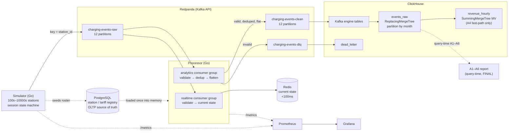

# Architecture & Design Decisions

EV charging data pipeline — real-time + analytics. This document explains *why* each
piece is what it is, the alternatives considered, and what is deliberately left for
later. The analytics layer (Phase 3) is in §10 and the measured performance / scale
test (Phase 4) is in §11.

---

## 1. Requirements, restated

Two read patterns with very different shapes have to be served from one ingest stream:

- **Operational / real-time.** "What is connector X doing *right now*?" Point lookups
  on the latest state per connector, target **< 100 ms**, and the event has to be
  visible **< 1 s** after it happens.
- **Analytical.** Hourly/monthly/yearly aggregations over the full history — energy,
  uptime, revenue, fault geography — scanning large time ranges.

Plus: a synthetic source at **10k–100k events/sec**, **at-least-once** delivery
(duplicates are expected and must be handled), and late / out-of-order arrival.

One store cannot do both well. A row store tuned for low-latency point reads is poor
at scanning hundreds of millions of rows for an aggregate; a columnar OLAP store is
excellent at the scan and wrong for a hot single-key lookup. So the design splits the
stores by access pattern and keeps a single validated ingest path feeding both.

---

## 2. Architecture



---

## 3. Store selection

### Kafka (Redpanda) — ingest backbone

A durable, partitioned log decouples a bursty producer from downstream consumers and
lets multiple independent consumers read the same stream at their own pace — which is
exactly how the real-time and analytics paths are separated (Section 5). Partitioning
by `station_id` gives **per-station ordering** without a global bottleneck.

**Redpanda** over Apache Kafka for this exercise: a single binary, no JVM and no
ZooKeeper/KRaft sidecar, so `docker compose up` is clean and the footprint on a
laptop is small. It is Kafka-API compatible, so nothing downstream is Redpanda-specific
and a production move to MSK / Confluent / Strimzi is a config change, not a rewrite.

### Redis — real-time current state

The operational question is a **point lookup of the latest value per connector**, not
a time-series scan. That is a key-value access pattern, and Redis serves it from memory
in well under a millisecond. The processor maintains one hash per connector
(`station:{id}:{conn}` → power, status, soc, session, last-seen), so "current state"
is a single `HGETALL`. Station-level HEARTBEAT liveness is kept under a separate
`station_liveness:{id}` key, so station liveness and connector state stay distinct
domains rather than the heartbeat masquerading as a connector-0 hash.

Alternatives considered: **TimescaleDB / InfluxDB** are time-series stores and would
work, but they are built for *range* queries over recent history; for a pure
latest-value lookup they are heavier than a key-value store and add query latency.
TimescaleDB is attractive because it is PostgreSQL (honoring the advert) — but the
access pattern, not the badge, should pick the store, and the pattern here is
key-value. **Cassandra** is over-provisioned for a working-set that fits in memory.

Duplicates on this path are harmless: re-applying the same `METER_UPDATE` to current
state is idempotent (last write wins), so the real-time path does not need strict
dedup, which keeps its latency low.

**Two Redis instances, not one — opposite eviction needs.** The dedup layer (the analytics
path's `dedup:{event_id}` keys) and this current-state store run on **separate** Redis
instances because their memory lifecycles are opposite. Dedup keys are write-once and *safe
to evict* — ClickHouse's ReplacingMergeTree is the authoritative backstop, so a lost key only
lets a duplicate through to be collapsed. State hashes *must not* be evicted before their TTL
— Redis is the only store, so an early eviction silently breaks the "seen in the last 5
minutes" guarantee. One shared `allkeys-lru` instance would let a dedup flood (~12M keys at
the 100k preset, over the 1 GB cap) evict live state. So state runs `noeviction` and dedup
runs `allkeys-lru` on its own instance (`redis-dedup`) — a store-configuration split the two
access patterns demand, not one the badge does.

### ClickHouse — analytics

The analytical queries scan large time ranges and aggregate. Columnar storage reads
only the columns a query touches; vectorised execution and the MergeTree family make
A1–A6 fast even over hundreds of millions of rows. ClickHouse also **self-ingests from
Kafka** via its Kafka engine, so there is no row-by-row `INSERT` from application code
(the classic way to fall over at scale) — the engine batches internally.

Alternatives: **DuckDB** is excellent but embedded/single-process and not built for a
continuously-ingesting streaming sink. **BigQuery** is a managed warehouse — great
analytics, wrong fit for a self-contained local stack with a < 1 s freshness goal and
no streaming-insert cost model.

### PostgreSQL — registry (OLTP source of truth)

Reference data — stations, connectors, tariffs — is small, relational, and mutable.
It belongs in an OLTP store, not duplicated as the authority inside the event
firehose. This is the OLAP/OLTP split applied honestly: Postgres owns the *registry*;
ClickHouse owns the immutable *events*. The processor loads the station registry —
ids plus each station's operator, city, country and coordinates, and the tariff set —
from Postgres **once into memory** at startup for referential validation: an event for
an unknown station, or one whose operator / city / country / coordinates or tariff
disagree with the registered station, is dead-lettered (so a well-formed event with a
wrong operator can't quietly pollute per-operator analytics) — and Postgres is never on
the hot path. The roster and tariffs are seeded transactionally by the simulator from a
single canonical catalog rather than duplicated as SQL literals, so prices cannot drift
between the generator and the registry. Postgres is also the most cleanly **droppable**
component if scope tightens.

---

## 4. Data model & schema

### Event schema: nested raw, flat clean

The simulator emits **nested** JSON to the raw topic (OCPI/OCPP-flavoured:
`location{}`, `meter{}`, `vehicle{}`, `fault{}`), which is realistic and what a real
device/CPO would send. The processor **flattens** it when producing to the clean
topic, because a flat row maps directly onto ClickHouse columns and avoids nested-JSON
parsing in the hot ingest path. So the transform earns its place: nested-and-realistic
on the way in, flat-and-analytics-friendly on the way to storage.

Key fields: `event_id` (UUID — the logical dedup identity, unique per event), `event_type`, `station_id`,
`connector_id`, `session_id`, `timestamp` (event-time, ms, UTC), plus the meter /
vehicle / location / fault sub-objects and, on stop, `cost_eur` with `is_peak_priced`
(1 when the simulator billed that session at the peak multiplier).

This nested schema is **mirrored on purpose** in two places — the simulator's wire
producer (`./simulator`) and the processor's consumer (`./processor/transform`) — rather
than shared through a common Go module. They are independently deployed services, so the
right coupling is a schema *contract*, not a compile-time code dependency that would
re-link them into one unit. Drift is guarded today by `processor/transform/flatten_test.go`,
which pins the flattened field names exactly to the ClickHouse columns and asserts the
nested sub-objects lift through; the production upgrade is the schema registry
(Avro/Protobuf on Redpanda's `:8081`) already listed in §8, which promotes that contract
from a test into an enforced, versioned artifact. This is a deliberate boundary, not a
missed opportunity to deduplicate types.

### ClickHouse table design

```
ENGINE = ReplacingMergeTree(ingested_at)
PARTITION BY toYYYYMM(timestamp)
ORDER BY (station_id, connector_id, event_type, timestamp, event_id)
TTL toDateTime(timestamp) + INTERVAL 13 MONTH
```

- **ReplacingMergeTree(ingested_at)** is the *second* dedup layer. Two copies of an
  event share `event_id` and every other field, so they collapse to one on merge;
  `ingested_at` is the version that decides which copy survives. This catches any
  late-arriving duplicate that fell outside the processor's Redis dedup window.
  (Caveat: collapsing happens on background merge, so exact-once reads use `FINAL`
  or `argMax`/`GROUP BY` — applied in the A-queries where correctness needs it.)
- **Partition by month of event-time** matches the monthly/yearly reporting grain and
  lets the engine prune whole partitions; the 13-month TTL drops old data cheaply.
- **ORDER BY** leads with `station_id, connector_id` for query locality (most reports
  filter/group by station), with `event_id` last so the dedup key is unique per event.
- **Codecs**: `DoubleDelta` for monotonic timestamps, `Gorilla` for slowly-changing
  float sensor values (power/energy/voltage/current), `LowCardinality` for the small
  string domains (event_type, city, operator, tariff). These cut storage and I/O
  substantially on exactly the columns the firehose is dominated by.

---

## 5. Pipeline design

### Two consumer groups, not one

The real-time and analytics paths have opposite priorities: real-time wants **lowest
latency**, analytics wants **highest throughput** and exactly-once semantics. Putting
them in one consumer would couple a slow batch write to the latency-sensitive state
update. Kafka lets multiple consumer **groups** each read the full stream
independently, so:

- **realtime consumer group** → validate → update Redis current state. No strict
  dedup (idempotent), tuned for latency.
- **analytics consumer group** → validate → dedup → flatten → produce to clean topic
  (which ClickHouse drains). Batched, tuned for throughput.

Failure isolation falls out for free: if ClickHouse ingestion stalls, the analytics
group lags but the real-time view stays fresh, and vice versa. The simpler
single-consumer design is a valid MVP; this is the version that answers the case's
"single pipeline vs separate" question with the stronger trade-off.

### Real-time current state is deliberately best-effort

The real-time path is a **best-effort state projection**, and that is a chosen trade-off,
not a gap. It validates every event but does **not** dead-letter — the analytics group
owns validation and the DLQ — and it **commits its offsets even when the Redis CAS fails**
after one bounded retry (~50 ms), rather than head-of-line-blocking a whole partition on a
Redis blip. It can afford this because current state is **self-healing**: an active
connector emits its next `METER_UPDATE` within ≤30 s (the meter cadence tops out at 30 s),
which overwrites any missed update, and the per-key TTL (5 min by default) expires anything
that goes silent — so a lost write is corrected by the next event or aged out, not left
stale forever. The stronger-recovery upgrade is a named **future item**: a log-compacted
state-rebuild topic (or a state DLQ with replay) that lets the projection be reconstructed
exactly after a Redis loss, instead of leaning on the next event to refresh it.

### Deduplication (the at-least-once requirement)

The dedup **identity** is `event_id` (UUID), not `session_id + timestamp` — the latter
collides across the many meter readings of one session and would wrongly drop distinct
events. That identity is *logical*: it names the event. The storage layer's dedup is
*physical* — it collapses rows sharing the full sort key (item 2 below), not `event_id`
alone. The two coincide by construction, because a genuine at-least-once duplicate is a
byte-identical re-send (same `event_id` *and* same tuple); a repeated `event_id` under a
*different* tuple would be an invariant violation (`event_id` is unique per event), not a
duplicate storage is expected to catch. Either way the exact analytics stay
`event_id`-exact — `uniqExact(event_id)` / `argMax` / `FINAL` — independent of what a
background merge has or hasn't collapsed. Correctness is layered, and the point that
matters is **where it lives**:

1. **Hot path (best-effort optimization):** the analytics consumer orders each event
   `EXISTS event_id → produce to clean → Mark event_id` (`SET`, `EX <ttl>`). Marking
   only *after* a durable produce is deliberate: a crash between produce and mark
   re-produces a *duplicate* (which the storage layer collapses) rather than dropping a
   *unique* event — the failure mode a bare `SET NX` *before* producing would cause, and
   which ClickHouse could never recover. The TTL is sized to the realistic redelivery
   window (a minute or two), *not* hours; the storage layer covers anything later.
   Duplicates share `station_id`, so they land on one partition and one worker —
   `EXISTS`/`Mark` never race.
2. **Storage (authoritative):** the landing table is `ReplacingMergeTree(ingested_at)`
   ordered by `(station_id, connector_id, event_type, timestamp, event_id)`. It collapses
   rows sharing that **full sort key** — identical for a genuine re-send of one event —
   during background merges; reads needing exactness before a merge use `FINAL` /
   `uniqExact(event_id)`. **This is the dedup authority; Redis is only load-shedding in
   front of it.**

A **Bloom / Cuckoo filter** was considered for the hot path (tiny memory at huge
cardinality) and rejected as the *primary* mechanism: its false positives would drop a
*unique* event, which violates at-least-once. It is viable only as a pre-filter in
front of an exact check, which is not worth the complexity here.

### Late & out-of-order events

Windows are computed on **event-time** (`timestamp`), while `ingested_at` (processing
time) is kept for lag metrics. An event arriving after its window has been published is
not lost: it lands in the same table, and the reports re-resolve it at query time via
`FINAL` / `uniqExact` reads once late rows merge. (The single streaming rollup, revenue,
is the one exception; its exact counterpart is the A4 `FINAL` query.)
There is no watermark or grace bound: every event is accepted no matter how late, and
ordering is resolved entirely at query time (event-time windows + `FINAL`). The tradeoff
is that a pathologically late event silently merges into and shifts an already-published
historical aggregate; a stricter policy (a watermark plus an `is_late` flag and a
late-event route) is a documented future item, not built here. The simulator deliberately
injects a configurable fraction of out-of-order and duplicate events so this path is
exercised, not assumed.

### Validation & dead-letter

Events are validated for schema (required fields, types, ranges) and **referentially**
against the in-memory registry from Postgres: the station must exist, and its operator,
city, country and coordinates (and any tariff) must match the registered station — so a
well-formed event carrying the wrong operator or city is rejected, not quietly counted.
Failures are not dropped silently — they are published to `charging-events-dlq` as
`{raw_payload, error, ingested_at}` and landed in `ClickHouse.dead_letter`, so "what got
rejected and why" is one SQL query.

---

## 6. The energy double-count trap (correctness)

`energy_kwh` in a `METER_UPDATE` is the session's **cumulative** meter register, not the
increment since the last reading. Naively `SUM(energy_kwh)` over raw meter rows counts
the running total once per reading and over-states energy by roughly the number of
readings per session — often 10×–50×. The analytics layer therefore computes **per-session
deltas** (`max(energy) − min(energy)` per session, or the increment between consecutive
readings via window functions, or the total carried on `SESSION_STOP`) and only then
aggregates to the hour/day/month. This is called out explicitly because it is the single
easiest way to ship plausible-looking but wrong numbers.

---

## 7. Language choice — Go (+ Python)

- **Go** for the simulator and processor: true parallelism (no GIL) is what makes a
  100k/sec hot path realistic; cheap goroutines fit the per-station/per-connector
  concurrency; a single static binary keeps the containers tiny and `compose up` fast;
  and `pprof` + built-in benchmarks directly serve the Phase-4 performance work. It is
  also a natural neighbour to the team's JVM stack.
- **Python** for the analytics/reporting layer (Phase 3): the right tool for the A1–A6
  notebook and charts, against ClickHouse over its HTTP interface.

The advert is Java-first; Go is the closest idiomatic fit for this latency/throughput
profile and is used here for the data-plane, with Python for analysis. A production
build on the team's JVM stack would port the same two-consumer-group design directly.

---

## 8. Path to production

- **Schema registry + a typed contract** (Avro/Protobuf) on the topics instead of
  free-form JSON, with compatibility enforcement.
- **dbt (dbt-clickhouse)** for the analytical models: A1–A6 and downstream marts as
  versioned, tested dbt models on top of the raw landing table, with the real-time
  rollups staying as materialized views. (The advert lists dbt as preferred; this is
  where it fits — batch transformation on top of the stream, not in the hot path.)
- **Airflow for the batch layer**: the opt-in `ev_analytics_daily` DAG
  (`deploy/airflow/`, behind the `airflow` Compose profile) already runs the five
  scheduled tasks that belong off the hot path — a data freshness gate,
  per-partition `OPTIMIZE`, exact revenue reconciliation from `events_raw FINAL`,
  a PSI data-quality gate, and a TTL report. Airflow stays off the hot path; the
  stream is supervised by the Kafka consumer-group coordinator, while batch owns
  the scheduled, whole-partition work a per-message consumer structurally cannot do.
- **Kubernetes** for orchestration: the compose services map to Deployments/
  StatefulSets; the processor and simulator scale horizontally by adding consumers up
  to the partition count. (Compose is the deliverable here per the brief; K8s is the
  production target, not a local requirement.)
- **Exactly-once** end-to-end via Kafka transactions / idempotent producers where the
  business case justifies the throughput cost (today: at-least-once + idempotent
  consumers, which is the pragmatic default).
- **Tiered retention**: hot recent data in ClickHouse, older partitions to object
  storage (S3-backed MergeTree) behind the TTL.
- **Real observability SLOs**: alert on ingestion lag, consumer-group lag, dead-letter
  rate, and freshness, not just dashboards.

---

## 9. Limitations & honest trade-offs

- At-least-once, not exactly-once: chosen deliberately; dedup makes it effectively
  once for analytics, and the real-time path is idempotent.
- ReplacingMergeTree dedup is eventual (on merge); reads needing exactness pay the
  `FINAL` cost. Acceptable for reporting; called out rather than hidden.
- Postgres referential validation reads an in-memory registry snapshot, refreshed on a
  config-gated interval (`registry.refresh_sec`, default 300 s) via an atomic snapshot swap,
  so reads stay lock-free and a failed/empty reload keeps the prior snapshot. The residual
  limitation is bounded staleness: a station added mid-interval is invisible until the next
  refresh tick, so its events dead-letter as `unknown_station` until then; sub-second
  propagation would need push invalidation (Postgres `LISTEN/NOTIFY` or a registry topic).
- The simulator approximates charging physics (a simple taper curve, fixed nominal
  voltages); it is realistic enough to make the analytics meaningful, not a battery
  model.
- Analytics redelivery on a downstream-write failure forces a consumer-group rejoin
  to re-read the uncommitted batch (kafka-go only redelivers uncommitted offsets on a
  new generation). This preserves at-least-once — the batch is never committed before
  a durable produce — and is harmless on a transient blip, but under a *sustained*
  ClickHouse/clean-topic outage the group can rebalance repeatedly instead of draining
  smoothly on recovery. The cleaner shape is to retry the already-in-hand batch in
  place (no rejoin, same at-least-once ordering); it is deliberately deferred rather
  than changed on the commit path right before submission, and wants live
  fault-injection (stop the sink, confirm `count() == uniqExact(event_id)` on recovery)
  before it lands.

---

## 10. Analytics layer (Phase 3)

The six analytical questions are answered by the queries in `analytics/queries/`
(A1–A6), run at query time against `events_raw`, plus a Python notebook
(`analytics/report.ipynb`) that executes them and writes `analytics/output/A1..A6.csv`.

**Only revenue is a streaming aggregate.** `deploy/clickhouse/init/02_aggregates.sql`
defines exactly one materialized view — `revenue_hourly` (SummingMergeTree) — as a *fast,
slightly approximate* dashboard rollup. `cost_eur` is a per-`SESSION_STOP` scalar, so
summing one row per session inside a single insert block is correct. It is only
*approximate* because the MV fires before the ReplacingMergeTree dedup, so a duplicate
that escapes the Redis window is counted twice; the **authoritative** revenue is the A4
query, which reads `events_raw FINAL`. A dedup-safe pre-aggregate would be a *refreshable*
MV that periodically recomputes from `FINAL`.

**Peak revenue is what was billed at a peak *premium*, not a clock window.** The simulator
applies each tariff's multiplier inside the peak windows it reads from the config's
`peak_windows` (the same 07–09 / 17–20 the spec and arrival-weighting use — one source of
truth, not a hardcoded literal), and sets `is_peak_priced` on the SESSION_STOP row **only
when a premium was actually charged** (`PeakMult > 1.0`), not merely when the clock was
in-window. So a `standard-v1` stop at 18:00 (multiplier 1.00, billed at base) and a
discounted `off-peak-v1` stop are correctly *not* flagged peak, while a `peak-rate-v2` stop
is. A4 and the `revenue_hourly` rollup take `peak_revenue_eur` straight from that flag
(`sumIf(cost_eur, is_peak_priced = 1)`) instead of re-deriving peak from `toHour(timestamp)`
downstream, so a base-rate session is never filed as peak revenue for its clock hour and a
peak-billed session just outside a reporting window is not dropped from it.

**A1, A2, A3, A5, A6 are query-time exact analytics, not MVs — deliberately.** Each needs
state spanning *many* insert blocks, which a streaming MV (block-local) cannot hold:

- energy (A1, A3) is a per-session **delta** of the cumulative meter register — `max−min`
  or the increment between consecutive readings across a whole session, whose readings
  arrive over many blocks;
- uptime (A2) reconstructs each connector's **status timeline** (segment durations between
  STATUS_CHANGE events), again cross-block, and carries forward the state active before the
  window opens;
- fault geography (A5) and power anomalies (A6) dedup by `event_id` / compute fleet-wide
  statistics over the full history.

Expressing these exactly means reading `events_raw` (with `FINAL` / `uniqExact` where a
pre-merge duplicate would otherwise show) at query time — which ClickHouse does quickly.

**Event-time, not wall-clock.** With `time_acceleration > 1` the simulated event clock runs
ahead of wall time, so the time-windowed queries (A1 = 7 days, A4/A5 = 30 days) anchor the
window to `max(timestamp)` in the data, not `now()`, which would otherwise clip it.

**The energy double-count trap** (§6) is the correctness spine of this layer: no query uses
`SUM(energy_kwh)`.

---

## 11. Performance — measured scale test (Phase 4)

The harness (`scripts/scale_test.sh`) drives the simulator through four presets by swapping
`CONFIG_PATH` (recreating `registry-seed` -> `simulator` -> `processor` per preset so the
processor's in-memory registry matches the new roster), then records produced vs clean
**throughput**, **three wall-clock store-write lags** (produce → clean-topic, → Redis apply,
→ ClickHouse queryable), **authoritative Redpanda consumer-group lag** (not the processor's
best-effort gauge), and A1/A4 **query latency** to
`benchmarks/results.csv`. It **preflights** every dependency (Prometheus, ClickHouse, Redis,
Redpanda, and the four preset files) and hard-fails rather than emit plausible-looking numbers
off a broken stack, and it **resets to a clean slate** (`docker compose down -v && up -d`)
before the first preset so the 1k row measures steady state, not a drained backlog.
`produced_eps` is the Redpanda raw-topic **offset delta over the measure window** - events the
broker actually accepted - not the simulator's async enqueue counter.

The checked-in curve is the final tuned run on one laptop (macOS + Docker Desktop), with
Redpanda still in `dev-container` mode but raised to `--smp=4 --memory=4G`, the raw/clean topics
at 12 partitions, and processor workers set to 12 realtime + 12 analytics. The run used an
extended warm-up before each measurement window so the 100k row reflects steady-state behavior
rather than the initial group-rebalance backlog.

| preset | produced_eps | clean_eps | clean_lag s (p50/p95/p99) | rt_apply s (p50/p95/p99) | ch_fresh s | realtime_lag | analytics_lag | a1_ms | a4_ms | redis_ms |
|-------:|-------------:|----------:|:-------------------------:|:------------------------:|:----------:|-------------:|--------------:|------:|------:|---------:|
| 1k   | 1,019   | 1,001   | 0.39 / 0.93 / 0.99 | 0.038 / 0.049 / 0.050 | 3.9 | 44     | 419    | 24    | 12    | 89  |
| 10k  | 10,196  | 10,008  | 0.17 / 0.25 / 0.76 | 0.038 / 0.049 / 0.050 | 2.7 | 385    | 1,394  | 109   | 74    | 90  |
| 50k  | 51,207  | 50,202  | 0.08 / 0.23 / 0.25 | 0.038 / 0.049 / 0.097 | 3.5 | 1,263  | 4,326  | 1,368 | 703   | 85  |
| 100k | 104,528 | 102,666 | 0.07 / 0.22 / 0.43 | 0.043 / 0.335 / 0.693 | 3.9 | 11,599 | 10,088 | 5,415 | 2,243 | 147 |

**What was fixed.** The first measured ceiling was not JSON decode. The hot-path benchmark
(`BenchmarkFlattenValidate`) is a few microseconds per event, while the profile in
`benchmarks/profile-summary.txt` showed the processor dominated by network/syscall time from
per-event Kafka produce/commit and Redis round trips. The processor now amortises that I/O:

- **Analytics path (H1):** each reader accumulates a size-or-time batch, runs one pipelined Redis
  `EXISTS`, writes the fresh clean events with one durable `WriteMessages`, writes invalid rows
  to the DLQ in one batch, marks fresh ids with one pipelined Redis `SET`, and commits the whole
  batch only after the downstream writes succeed. This preserves the at-least-once ordering:
  produce before mark before commit, so a crash replays duplicates instead of dropping unique
  events.
- **Realtime path (H2):** each reader accumulates a bounded min(N=750, T=25 ms) micro-batch,
  applies the same CAS script for every current-state update in one Redis pipeline, and commits
  the batch once. This path remains deliberately best-effort: it retries the Redis pipeline once
  and then commits even on failure because current state self-heals from the next event, while
  blocking a partition on a Redis blip would make every connector on that partition stale.

**Throughput.** The tuned run keeps the analytics path essentially at input rate through the
full curve: at 100k, `clean_eps` is 102,666/s against 104,528 accepted raw events/s. The
authoritative consumer-group lag is bounded rather than growing without limit — at 100k,
`realtime_lag` is 11,599 events and `analytics_lag` is 10,088 events, roughly 0.11 s and 0.10 s
of backlog relative to the measured input rate. The Redis point read remains dominated by
`docker compose exec` overhead (`redis_ms` 85–147 ms in the CSV; a native `HGETALL` is
sub-millisecond), so the current-state store itself is not the limiter.

**Store-write lag (produce → each store).** The case asks for ingestion lag from event
production to store write, so the harness measures three wall-clock lags, each anchored to the
raw Kafka produce time (`produced_at`, carried end to end into ClickHouse) and therefore immune
to `time_acceleration`:

- **`clean_lag`** — produce → durably on the clean topic (the analytics path's own write),
  from `processor_transport_lag_seconds`. Sub-second across the whole curve (p99 0.99 / 0.76 /
  0.25 / 0.43 s at 1k / 10k / 50k / 100k).
- **`rt_apply`** — produce → Redis current-state apply, the realtime store-write SLO, from the
  new `processor_state_apply_lag_seconds` emitted right after the CAS returns. This is the
  number the freshness target is really about: p99 is **50 ms through 50k and 0.69 s at 100k**
  — under 1 s even at saturation, measured directly rather than inferred from consumer lag.
- **`ch_fresh`** — produce → queryable in ClickHouse, sampled as `now() − max(produced_at)`.
  Holds ~3–4 s across the curve; that is the Kafka-engine block-flush cadence (throughput
  tracks input the whole way up, so it is not a growing backlog), and it is the one lag that
  includes the asynchronous engine-ingest hop the processor does not control.

An earlier version of this section had only `processor_transport_lag_seconds` (the analytics
path's clean-topic write) with a 10 s top bucket, whose p95/p99 saturated and could not be read
as the Redis freshness signal. That gap is now closed: the realtime-apply histogram is emitted
directly, and the lag buckets extend to 120 s so the percentiles stay real instead of pegging at
10. So the local compose run supports the case's realtime freshness target at 100k in the
strong sense — a direct produce→apply measurement, not just a consumer-lag inference.

**Query duration.** A1 and A4 are true server-side ClickHouse timings from
`clickhouse-client --time` (the harness no longer wall-clock-wraps `docker compose exec`). They
rise with both row count and concurrent full-rate Kafka-engine ingest: A1 is 5.4 s and A4 is
2.2 s in the 100k row. That is honest: the same single Docker node is producing, consuming,
ingesting, and scanning at once. The result still validates the two-store split - Redis serves
point reads, ClickHouse handles the scans - but it also shows where production would need more
resource isolation, larger Kafka-engine blocks / async inserts, or a refreshable aggregate for
the slowest exact reports.

**Remaining path to 100k and production.** For the take-home, the important point is that the
main local pipeline bottlenecks were measured, fixed, and re-measured rather than hand-waved. To
move this shape toward production: run Redpanda with real multi-node resources and RF >= 3, scale
processor replicas up to the partition count and then raise partitions, give ClickHouse dedicated
CPU/I/O and ReplicatedMergeTree/Keeper, add schema registry + Avro/Protobuf, and promote the
exact analytics queries into tested dbt models or refreshable aggregates where dashboard latency
needs to be sub-second.
