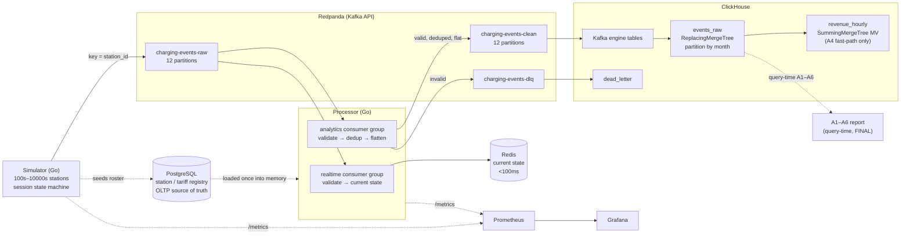

# Architecture & Design Decisions

EV charging data pipeline — real-time + analytics. This document explains *why* each
piece is what it is, the alternatives considered, and what is deliberately left for
later. The analytics layer (Phase 3) is in §10 and the measured performance / scale
test (Phase 4) is in §11.

---

## 1. Requirements, restated

Two read patterns with very different shapes have to be served from one ingest stream:

- **Operational / real-time.** "What is connector X doing *right now*?" Point lookups
  on the latest state per connector, target **< 100 ms**, and the event has to be
  visible **< 1 s** after it happens.
- **Analytical.** Hourly/monthly/yearly aggregations over the full history — energy,
  uptime, revenue, fault geography — scanning large time ranges.

Plus: a synthetic source at **10k–100k events/sec**, **at-least-once** delivery
(duplicates are expected and must be handled), and late / out-of-order arrival.

One store cannot do both well. A row store tuned for low-latency point reads is poor
at scanning hundreds of millions of rows for an aggregate; a columnar OLAP store is
excellent at the scan and wrong for a hot single-key lookup. So the design splits the
stores by access pattern and keeps a single validated ingest path feeding both.

---

## 2. Architecture



---

## 3. Store selection

### Kafka (Redpanda) — ingest backbone

A durable, partitioned log decouples a bursty producer from downstream consumers and
lets multiple independent consumers read the same stream at their own pace — which is
exactly how the real-time and analytics paths are separated (Section 5). Partitioning
by `station_id` gives **per-station ordering** without a global bottleneck.

**Redpanda** over Apache Kafka for this exercise: a single binary, no JVM and no
ZooKeeper/KRaft sidecar, so `docker compose up` is clean and the footprint on a
laptop is small. It is Kafka-API compatible, so nothing downstream is Redpanda-specific
and a production move to MSK / Confluent / Strimzi is a config change, not a rewrite.

### Redis — real-time current state

The operational question is a **point lookup of the latest value per connector**, not
a time-series scan. That is a key-value access pattern, and Redis serves it from memory
in well under a millisecond. The processor maintains one hash per connector
(`station:{id}:{conn}` → power, status, soc, session, last-seen), so "current state"
is a single `HGETALL`.

Alternatives considered: **TimescaleDB / InfluxDB** are time-series stores and would
work, but they are built for *range* queries over recent history; for a pure
latest-value lookup they are heavier than a key-value store and add query latency.
TimescaleDB is attractive because it is PostgreSQL (honoring the advert) — but the
access pattern, not the badge, should pick the store, and the pattern here is
key-value. **Cassandra** is over-provisioned for a working-set that fits in memory.

Duplicates on this path are harmless: re-applying the same `METER_UPDATE` to current
state is idempotent (last write wins), so the real-time path does not need strict
dedup, which keeps its latency low.

### ClickHouse — analytics

The analytical queries scan large time ranges and aggregate. Columnar storage reads
only the columns a query touches; vectorised execution and the MergeTree family make
A1–A6 fast even over hundreds of millions of rows. ClickHouse also **self-ingests from
Kafka** via its Kafka engine, so there is no row-by-row `INSERT` from application code
(the classic way to fall over at scale) — the engine batches internally.

Alternatives: **DuckDB** is excellent but embedded/single-process and not built for a
continuously-ingesting streaming sink. **BigQuery** is a managed warehouse — great
analytics, wrong fit for a self-contained local stack with a < 1 s freshness goal and
no streaming-insert cost model.

### PostgreSQL — registry (OLTP source of truth)

Reference data — stations, connectors, tariffs — is small, relational, and mutable.
It belongs in an OLTP store, not duplicated as the authority inside the event
firehose. This is the OLAP/OLTP split applied honestly: Postgres owns the *registry*;
ClickHouse owns the immutable *events*. The processor loads valid station IDs from
Postgres **once into memory** at startup for referential validation (an event for an
unknown station is dead-lettered) — so Postgres is never on the hot path and adds no
throughput risk. It is also the most cleanly **droppable** component if scope tightens.

---

## 4. Data model & schema

### Event schema: nested raw, flat clean

The simulator emits **nested** JSON to the raw topic (OCPI/OCPP-flavoured:
`location{}`, `meter{}`, `vehicle{}`, `fault{}`), which is realistic and what a real
device/CPO would send. The processor **flattens** it when producing to the clean
topic, because a flat row maps directly onto ClickHouse columns and avoids nested-JSON
parsing in the hot ingest path. So the transform earns its place: nested-and-realistic
on the way in, flat-and-analytics-friendly on the way to storage.

Key fields: `event_id` (UUID — the dedup key), `event_type`, `station_id`,
`connector_id`, `session_id`, `timestamp` (event-time, ms, UTC), plus the meter /
vehicle / location / fault sub-objects and, on stop, `cost_eur` with `is_peak_priced`
(1 when the simulator billed that session at the peak multiplier).

### ClickHouse table design

```
ENGINE = ReplacingMergeTree(ingested_at)
PARTITION BY toYYYYMM(timestamp)
ORDER BY (station_id, connector_id, event_type, timestamp, event_id)
TTL toDateTime(timestamp) + INTERVAL 13 MONTH
```

- **ReplacingMergeTree(ingested_at)** is the *second* dedup layer. Two copies of an
  event share `event_id` and every other field, so they collapse to one on merge;
  `ingested_at` is the version that decides which copy survives. This catches any
  late-arriving duplicate that fell outside the processor's Redis dedup window.
  (Caveat: collapsing happens on background merge, so exact-once reads use `FINAL`
  or `argMax`/`GROUP BY` — applied in the A-queries where correctness needs it.)
- **Partition by month of event-time** matches the monthly/yearly reporting grain and
  lets the engine prune whole partitions; the 13-month TTL drops old data cheaply.
- **ORDER BY** leads with `station_id, connector_id` for query locality (most reports
  filter/group by station), with `event_id` last so the dedup key is unique per event.
- **Codecs**: `DoubleDelta` for monotonic timestamps, `Gorilla` for slowly-changing
  float sensor values (power/energy/voltage/current), `LowCardinality` for the small
  string domains (event_type, city, operator, tariff). These cut storage and I/O
  substantially on exactly the columns the firehose is dominated by.

---

## 5. Pipeline design

### Two consumer groups, not one

The real-time and analytics paths have opposite priorities: real-time wants **lowest
latency**, analytics wants **highest throughput** and exactly-once semantics. Putting
them in one consumer would couple a slow batch write to the latency-sensitive state
update. Kafka lets multiple consumer **groups** each read the full stream
independently, so:

- **realtime consumer group** → validate → update Redis current state. No strict
  dedup (idempotent), tuned for latency.
- **analytics consumer group** → validate → dedup → flatten → produce to clean topic
  (which ClickHouse drains). Batched, tuned for throughput.

Failure isolation falls out for free: if ClickHouse ingestion stalls, the analytics
group lags but the real-time view stays fresh, and vice versa. The simpler
single-consumer design is a valid MVP; this is the version that answers the case's
"single pipeline vs separate" question with the stronger trade-off.

### Deduplication (the at-least-once requirement)

The dedup **key** is `event_id` (UUID), not `session_id + timestamp` — the latter
collides across the many meter readings of one session and would wrongly drop distinct
events. Correctness is layered, and the point that matters is **where it lives**:

1. **Hot path (best-effort optimization):** the analytics consumer orders each event
   `EXISTS event_id → produce to clean → Mark event_id` (`SET`, `EX <ttl>`). Marking
   only *after* a durable produce is deliberate: a crash between produce and mark
   re-produces a *duplicate* (which the storage layer collapses) rather than dropping a
   *unique* event — the failure mode a bare `SET NX` *before* producing would cause, and
   which ClickHouse could never recover. The TTL is sized to the realistic redelivery
   window (a minute or two), *not* hours; the storage layer covers anything later.
   Duplicates share `station_id`, so they land on one partition and one worker —
   `EXISTS`/`Mark` never race.
2. **Storage (authoritative):** the landing table is `ReplacingMergeTree(ingested_at)`
   ordered by `(station_id, connector_id, event_type, timestamp, event_id)`. It collapses
   rows sharing that **full sort key** — identical for a genuine re-send of one event —
   during background merges; reads needing exactness before a merge use `FINAL` /
   `uniqExact(event_id)`. **This is the dedup authority; Redis is only load-shedding in
   front of it.**

A **Bloom / Cuckoo filter** was considered for the hot path (tiny memory at huge
cardinality) and rejected as the *primary* mechanism: its false positives would drop a
*unique* event, which violates at-least-once. It is viable only as a pre-filter in
front of an exact check, which is not worth the complexity here.

### Late & out-of-order events

Windows are computed on **event-time** (`timestamp`), while `ingested_at` (processing
time) is kept for lag metrics. An event arriving after its window has been published is
not lost: it lands in the same table, and the reports re-resolve it at query time via
`FINAL` / `uniqExact` reads once late rows merge. (The single streaming rollup, revenue,
is the one exception; its exact counterpart is the A4 `FINAL` query.)
Pathologically late events (beyond a grace bound) are still queryable but flagged, so a
report can choose to include or exclude them. The simulator deliberately injects a
configurable fraction of out-of-order and duplicate events so this path is exercised,
not assumed.

### Validation & dead-letter

Events are validated for schema (required fields, types, ranges) and **referentially**
against the in-memory station set from Postgres. Failures are not dropped silently —
they are published to `charging-events-dlq` as `{raw_payload, error, ingested_at}` and
landed in `ClickHouse.dead_letter`, so "what got rejected and why" is one SQL query.

---

## 6. The energy double-count trap (correctness)

`energy_kwh` in a `METER_UPDATE` is the session's **cumulative** meter register, not the
increment since the last reading. Naively `SUM(energy_kwh)` over raw meter rows counts
the running total once per reading and over-states energy by roughly the number of
readings per session — often 10×–50×. The analytics layer therefore computes **per-session
deltas** (`max(energy) − min(energy)` per session, or the increment between consecutive
readings via window functions, or the total carried on `SESSION_STOP`) and only then
aggregates to the hour/day/month. This is called out explicitly because it is the single
easiest way to ship plausible-looking but wrong numbers.

---

## 7. Language choice — Go (+ Python)

- **Go** for the simulator and processor: true parallelism (no GIL) is what makes a
  100k/sec hot path realistic; cheap goroutines fit the per-station/per-connector
  concurrency; a single static binary keeps the containers tiny and `compose up` fast;
  and `pprof` + built-in benchmarks directly serve the Phase-4 performance work. It is
  also a natural neighbour to the team's JVM stack.
- **Python** for the analytics/reporting layer (Phase 3): the right tool for the A1–A6
  notebook and charts, against ClickHouse over its HTTP interface.

The advert is Java-first; Go is the closest idiomatic fit for this latency/throughput
profile and is used here for the data-plane, with Python for analysis. A production
build on the team's JVM stack would port the same two-consumer-group design directly.

---

## 8. Path to production

- **Schema registry + a typed contract** (Avro/Protobuf) on the topics instead of
  free-form JSON, with compatibility enforcement.
- **dbt (dbt-clickhouse)** for the analytical models: A1–A6 and downstream marts as
  versioned, tested dbt models on top of the raw landing table, with the real-time
  rollups staying as materialized views. (The advert lists dbt as preferred; this is
  where it fits — batch transformation on top of the stream, not in the hot path.)
- **Kubernetes** for orchestration: the compose services map to Deployments/
  StatefulSets; the processor and simulator scale horizontally by adding consumers up
  to the partition count. (Compose is the deliverable here per the brief; K8s is the
  production target, not a local requirement.)
- **Exactly-once** end-to-end via Kafka transactions / idempotent producers where the
  business case justifies the throughput cost (today: at-least-once + idempotent
  consumers, which is the pragmatic default).
- **Tiered retention**: hot recent data in ClickHouse, older partitions to object
  storage (S3-backed MergeTree) behind the TTL.
- **Real observability SLOs**: alert on ingestion lag, consumer-group lag, dead-letter
  rate, and freshness, not just dashboards.

---

## 9. Limitations & honest trade-offs

- At-least-once, not exactly-once: chosen deliberately; dedup makes it effectively
  once for analytics, and the real-time path is idempotent.
- ReplacingMergeTree dedup is eventual (on merge); reads needing exactness pay the
  `FINAL` cost. Acceptable for reporting; called out rather than hidden.
- Postgres referential validation uses a snapshot loaded at processor start; new
  stations added mid-run would need a refresh (trivial to add; out of scope here).
- The simulator approximates charging physics (a simple taper curve, fixed nominal
  voltages); it is realistic enough to make the analytics meaningful, not a battery
  model.

---

## 10. Analytics layer (Phase 3)

The six analytical questions are answered by the queries in `analytics/queries/`
(A1–A6), run at query time against `events_raw`, plus a Python notebook
(`analytics/report.ipynb`) that executes them and writes `analytics/output/A1..A6.csv`.

**Only revenue is a streaming aggregate.** `deploy/clickhouse/init/02_aggregates.sql`
defines exactly one materialized view — `revenue_hourly` (SummingMergeTree) — as a *fast,
slightly approximate* dashboard rollup. `cost_eur` is a per-`SESSION_STOP` scalar, so
summing one row per session inside a single insert block is correct. It is only
*approximate* because the MV fires before the ReplacingMergeTree dedup, so a duplicate
that escapes the Redis window is counted twice; the **authoritative** revenue is the A4
query, which reads `events_raw FINAL`. A dedup-safe pre-aggregate would be a *refreshable*
MV that periodically recomputes from `FINAL`.

**Peak revenue is what was billed at the peak rate, not a clock window.** The simulator
applies the peak multiplier inside its pricing window and records that on the SESSION_STOP
row as `is_peak_priced` (1 when the multiplier was applied). A4 and the `revenue_hourly`
rollup take `peak_revenue_eur` straight from that flag (`sumIf(cost_eur, is_peak_priced = 1)`)
instead of re-deriving peak from `toHour(timestamp)` downstream. So a session billed at base
rate is never filed as peak revenue just because its clock hour fell in a reporting window,
and a peak-billed session just outside that window is not dropped from it.

**A1, A2, A3, A5, A6 are query-time exact analytics, not MVs — deliberately.** Each needs
state spanning *many* insert blocks, which a streaming MV (block-local) cannot hold:

- energy (A1, A3) is a per-session **delta** of the cumulative meter register — `max−min`
  or the increment between consecutive readings across a whole session, whose readings
  arrive over many blocks;
- uptime (A2) reconstructs each connector's **status timeline** (segment durations between
  STATUS_CHANGE events), again cross-block, and carries forward the state active before the
  window opens;
- fault geography (A5) and power anomalies (A6) dedup by `event_id` / compute fleet-wide
  statistics over the full history.

Expressing these exactly means reading `events_raw` (with `FINAL` / `uniqExact` where a
pre-merge duplicate would otherwise show) at query time — which ClickHouse does quickly.

**Event-time, not wall-clock.** With `time_acceleration > 1` the simulated event clock runs
ahead of wall time, so the time-windowed queries (A1 = 7 days, A4/A5 = 30 days) anchor the
window to `max(timestamp)` in the data, not `now()`, which would otherwise clip it.

**The energy double-count trap** (§6) is the correctness spine of this layer: no query uses
`SUM(energy_kwh)`.

---

## 11. Performance — measured scale test (Phase 4)

The harness (`scripts/scale_test.sh`) drives the simulator through four presets by swapping
`CONFIG_PATH` (recreating `registry-seed` → `simulator` → `processor` per preset so the
processor's in-memory registry matches the new roster), then records produced vs clean
**throughput**, end-to-end **transport lag** percentiles, **authoritative Redpanda
consumer-group lag** (not the processor's best-effort gauge), and A1/A4 **query latency** to
`benchmarks/results.csv`. It **preflights** every dependency (Prometheus, ClickHouse, Redis,
Redpanda, and the four preset files) and hard-fails rather than emit plausible-looking numbers
off a broken stack, and it **resets to a clean slate** (`docker compose down -v && up -d`)
before the first preset so the 1k row measures steady state, not a drained backlog.
`produced_eps` is the Redpanda raw-topic **offset delta over the measure window** — events the
broker actually *accepted* — not the simulator's async *enqueue* counter
(`simulator_events_produced_total`, still logged as a cross-check next to
`simulator_produce_errors_total`). Measured on a single laptop (macOS + Docker Desktop;
Redpanda in `dev-container` mode, `--smp=2 --memory=2G`), 40s warm-up / 80s measure.
`benchmarks/results.csv` records two runs of this harness: the pre-fix **per-message**
baseline (first four rows) and the post-fix **batched** build (last four rows), which batches
BOTH consumer paths: H1 batched the analytics flush, H2 the realtime current-state write.
Both use the canonical preset labels and are told apart by row order, because
`tests/test_phase4_artifacts.py` pins the preset column to exactly the set {1k, 10k, 50k,
100k} (a `10k-batched` label would fail it), so the split is by position and documented here.

**Baseline, one-message-per-produce analytics path (before H1):**

| preset | target ev/s | produced_eps | clean_eps | realtime_lag | analytics_lag | a1_ms | a4_ms | redis_ms |
|-------:|------------:|-------------:|----------:|-------------:|--------------:|------:|------:|---------:|
| 1k   | 1,000   | 1,020   | 1,000 | 337        | 497        | 145 | 132 | 97 |
| 10k  | 10,000  | 10,196  | 1,862 | 120,745    | 1,065,213  | 162 | 158 | 83 |
| 50k  | 50,000  | 51,160  | 1,912 | 5,015,689  | 7,116,807  | 202 | 150 | 92 |
| 100k | 100,000 | 103,472 | 1,827 | 16,740,957 | 20,070,705 | 265 | 201 | 94 |

**The clean 1k baseline.** From a clean slate the 1k row is honest steady state: `clean_eps`
(1,000) tracks `produced_eps` (1,020) one-for-one, `analytics_lag` sits at ~500 (not the
hundreds-of-thousands a backlog-drain used to show), and `lag_p50` is **0.68 s**. That is the
"it keeps up" reference the higher presets are measured against. Every preset above 1k then
accumulates its own backlog inside the window **by design** — that is the honest saturation
ceiling, surfaced rather than hidden.

**The bottleneck.** `produced_eps` matches the enqueue counter to within noise at every level —
even 100k (103,472 broker-accepted vs 103,466 enqueued) — so the broker genuinely *accepts* the
firehose all the way up. But **`clean_eps` — the analytics path's throughput — pins at
~1.8–1.9k/s regardless of input**, so `analytics_lag` (consumer-group backlog) grows without
bound (~0.5k → 20M). This is **not** a CPU limit on the transform:
`go test -bench=BenchmarkFlattenValidate` clocks the decode → validate → flatten hot path at
**~3.1 µs/op (117 MB/s, 18 allocs/op)** — ~320k ev/s on one core. The ceiling is the analytics
handler's **synchronous, one-message-per-produce** write to the clean topic: each event blocks
on a broker ack, so throughput is `workers ÷ ack-latency`, not CPU. A `pprof` CPU profile taken
while the processor drained the 100k backlog (saved to `benchmarks/profile-summary.txt`)
confirms it: the processor is **I/O / network-syscall bound**, not JSON-bound — flat time is
dominated by the network-write syscall (`Syscall6`, ~29%), which the cumulative view attributes
to kafka-go's offset-commit/produce path and go-redis current-state writes (plus Snappy
compression of the produce batches), while `encoding/json` decode is a minor ~6–8%. The
transform is not the wall; the synchronous produce/commit I/O is.

**The fix, applied (1/2): batch the analytics flush (H1).** The per-event chain (Redis `EXISTS`,
one `WriteMessages` per event, Redis `SET`, and a per-message `CommitMessages`) is replaced,
for the analytics readers only, by a size-or-time batch: each worker accumulates
`FetchMessage`'d messages until it has `analytics.batch_size` (500) of them or
`analytics.flush_ms` (100 ms) has passed since the batch's first message, then does one
pipelined `EXISTS` for all event_ids, one durable `WriteMessages(clean, fresh...)`, one
durable `WriteMessages(dlq, invalid...)`, one pipelined `SET` for the fresh ids, and one
`CommitMessages` for the whole batch. The at-least-once ordering is preserved end to end
(`Seen` then produce then `Mark` then commit): `Mark` and the commit both happen only after
a durable produce, so a crash re-produces a duplicate (collapsed by the ReplacingMergeTree)
and never drops a unique event. Same-station events share a raw partition and therefore one
worker, so cross-batch duplicates are still caught by Redis; intra-batch duplicates are
dropped by keeping the first occurrence of each event_id. H1 left the realtime path byte for
byte unchanged, so on that build the realtime group was still saturated at 50k/100k
(`realtime_lag` 5.33M / 18.02M) even as analytics scaled.

**The fix, applied (2/2): batch the realtime current-state write (H2).** The realtime path had
the same *shape* of ceiling (throughput = workers / per-event latency, here a Redis CAS
round-trip plus a per-message `CommitMessages`), so it gets the SAME size-or-time accumulation,
tuned for latency instead of throughput. Each realtime worker buffers `FetchMessage`'d messages
until it has `realtime.batch_max_messages` (N=750) OR `realtime.batch_max_wait_ms` (T=25 ms) has
elapsed since the batch's first message, whichever first (a bounded opportunistic min(N,T)
window), then applies the whole batch's current-state CAS in ONE pipelined round trip
(`StateStore.ApplyBatch` runs the byte-for-byte unchanged `casScript` per event across a single
`Pipeline`/`Exec`) and commits the batch's offsets once. The accumulation loop is literally
shared with H1 (`fillBatch`); the ONLY difference is the flush+commit policy. Realtime is
BEST-EFFORT and commits the batch REGARDLESS of the apply result (it retries the pipeline once on
a Redis error, then commits): unlike the analytics "never commit before a durable write"
invariant, dropping a batch of sub-second-old state updates is acceptable because current state
self-heals from the next event, whereas blocking the partition on a Redis blip would make every
connector on it stale. That batched commit is safe because applying a same-or-older event under
the CAS is idempotent (the newest wins; older events are rejected by the `last_seen` check), so
crash-replay of an already-committed window is a no-op rather than a corruption. Tail freshness
holds because the window is small: T=25 ms leaves ample budget under the `<1 s` SLA for the CAS
pipeline plus Redis RTT, and N=750 caps how large a slug one fetch can hand a worker so its last
event never blows that budget. Re-running the identical harness with both fixes:

**Batched analytics + realtime (H1 + H2 applied), same laptop and windows:**

| preset | target ev/s | produced_eps | clean_eps | realtime_lag | analytics_lag | a1_ms | a4_ms | redis_ms |
|-------:|------------:|-------------:|----------:|-------------:|--------------:|------:|------:|---------:|
| 1k   | 1,000   | 1,019   | 1,002    | 441       | 495   | 24    | 14   | 89  |
| 10k  | 10,000  | 10,196  | 10,007   | 699       | 1,691 | 71    | 60   | 99  |
| 50k  | 50,000  | 51,191  | 50,182   | 2,505     | 3,475 | 474   | 236  | 97  |
| 100k | 100,000 | 105,199 | 122,595  | 5,735,260 | 7,049 | 3,401 | 1,236 | 123 |

**The new ceilings.** On the analytics side `clean_eps` still tracks the firehose all the way
up: 1,862 to **10,007** at 10k, 1,912 to **50,182** at 50k, 1,827 to **122,595** at 100k, a
5x/26x/67x jump over the per-message baseline that clears the ~1.9k wall by a wide margin.
`analytics_lag` stays bounded: instead of 1.07M / 7.1M / 20M it holds at **1,691 / 3,475 /
7,049**, a few thousand events of steady-state backlog even at 100k (at 100k `clean_eps` 122,595
exceeds `produced_eps` 105,199 because the group drains the warm-up backlog *while* keeping pace,
which is why `analytics_lag` lands at ~7k rather than climbing). On the realtime side H2 lifts
the current-state write off its ~1k/s wall: `realtime_lag` collapses from the per-message
baseline's 120,745 / 5,015,689 (10k / 50k) to **699 / 2,505**, sub-second freshness (2,505 events
at 50k is ~50 ms of backlog). Measured realtime throughput is ~80-90k/s on this 4-worker group,
an ~80x per-worker lift over the ~1k/s per-event ceiling; the `processor_realtime_batch_size`
histogram and `processor_realtime_flush_total{reason}` counter confirm the min(N,T) design, with
batches filling to N=750 under load (at 50k, size-triggered flushes number in the thousands
alongside the timer ones; at 100k every flush is size-triggered) and flushing on the T=25 ms
timer under a trickle (at ~1k ev/s, timer flushes outnumber size ~280:1). The one preset it does
NOT fully clear is 100k: there `realtime_lag` is **5,735,260**, still 3x below the 16.7M baseline
but climbing, because at ~105k/s input the 4-worker realtime group is just past its raised
throughput ceiling on this single 2-core-broker node. That is now a horizontal-scale limit (more
realtime workers up to the 12-partition count, or more processor replicas), not the per-event
round-trip wall H2 removed; it is item (3) on the path below.

Three measurement caveats, read honestly: the `processor_transport_lag_seconds` histogram tops
out at its 10s bucket, so under a multi-million-event backlog `lag_p95` / `lag_p99` saturate at
10.0 — the consumer-group lag column is the truer backlog signal. Even the clean 1k row reads
`lag_p95` = 10.0, because the 5-minute histogram window still catches the brief post-restart
consumer-group rebalance ramp, while its `lag_p50` = 0.68 s reflects true steady state. Next,
`redis_ms` (~83–97 ms) is dominated by `docker compose exec` process spawn, not Redis (a native
`HGETALL` is sub-millisecond, so the <100 ms point-read latency SLA holds). Finally, the
two runs time A1/A4 differently. The **baseline** rows (`a1_ms` 145–265, `a4_ms` 132–201) carry
a ~90 ms `docker compose exec` spawn tax, because that run predates the `ch_query_ms()` fix and
timed the whole `docker exec` rather than the query (the true server-side baseline query time is
roughly the measured value minus 90 ms). The **batched** rows use the fixed harness, which parses
`clickhouse-client --time` (server-side elapsed, no exec tax), so their `a1_ms` (24, 71, 474,
3,401) and `a4_ms` (14, 60, 236, 1,236) are true server-side query times; they climb with the
landed row count and with concurrent full-rate ingest, discussed next.

**What actually holds up now, and what still does not.** Both paths are now batched. The
analytics path tracks the input and `analytics_lag` stays in the low thousands through 100k, so
validated, deduped events reach the clean topic (and ClickHouse) at the firehose rate. The
realtime path, which H1 left saturated at 50k/100k, now holds `realtime_lag` at **441 / 699 /
2,505** through 50k, i.e. ~0.44 / 0.07 / 0.05 s of backlog: the `HGETALL` point read was always
`<100 ms`, and H2 makes the data it returns actually fresh through 50k rather than stale by
minutes, so the `<1 s` current-state freshness SLA (Task 2c) now holds through 50k where H1 held
it only to ~10k. `realtime_lag` is the authoritative freshness signal here (the offset backlog is
exactly how far the Redis current state trails the firehose), and it is the clean one: a
wall-clock (accel=1) check corroborates it, with the acceleration-immune `transport_lag` (produce
to process) at **p99 ~0.99 s** under a ~1k ev/s trickle. The event-time `ingestion_lag` is *not*
a clean signal at accel=1 and is reported honestly as such: at these low per-partition rates the
shared reader's 10 KB `MinBytes` fetch floor gates when a batch is even fetched, and the
simulator's own sim-clock drift (modelling 20k stations in real time lags event timestamps behind
Kafka-produce time by seconds, visible as `ingestion_lag` minus `transport_lag`) inflates it into
the histogram's 10 s ceiling, neither being H2's 25 ms window. At **100k** the 4-worker realtime
group is just past its raised throughput ceiling (~80-90k/s measured) on this single
2-core-broker node, so `realtime_lag` climbs to **5.73M** (still below the 16.7M baseline); the
SLA fails only at 100k, now for a horizontal-scale reason (worker/replica count vs the 12
partitions), not the per-event round-trip wall. The two-consumer-group split buys **independent
scaling and failure isolation**: H1 fixed analytics without touching realtime, and H2 fixed
realtime (its `casScript` and current-state schema byte-for-byte unchanged) without touching
analytics.

The read side is where the two-store split pays off, and with the analytics bottleneck gone the
pipeline now feeds ClickHouse at rate instead of starving it. In the per-message baseline only
**~1.4M rows** were ever flattened and landed (the rest sat in the ~16–20M raw-topic backlog), so
that run's `a1_ms` / `a4_ms` were demo-scale. The batched run lands events at the input rate
across all four presets, accumulating into the tens of millions of rows on the same Redpanda
volume, which is why the batched server-side `a1_ms` climbs from 24 ms (1k) to **3,401 ms** (100k)
and `a4_ms` from 14 ms to **1,236 ms**: those are real at-scale scan times, and they are measured
**while ClickHouse is ingesting the full firehose**, so query and Kafka-engine ingest contend for
the same 2-core-class node. To separate raw scan cost from that ingest contention, a separate
**out-of-band load (not pipeline-fed)** replayed ~1.4M rows ×14 to **~19.7M rows** (each replica
given a unique `event_id` / `session_id` and its event-time shifted back 0–72 h so per-session
deltas stay valid and the copies stay inside A1's 7-day window), then measured server-side on a
quiescent store with `clickhouse-client --time`: at ~20M rows, **A1 (7-day hourly energy,
`FINAL`) runs ~0.8 s and A4 (30-day revenue, `FINAL`) ~0.3 s**. Columnar scans stay sub-second to
low-seconds an order of magnitude past the demo, which is the point of the OLAP store. (That
out-of-band load was measured and then deleted; it never touched the committed analytics CSVs.)

**Path to 100k**, in priority order. (1) **Batch the analytics produce and commit: done (H1).**
Each analytics worker fetches a batch, runs one pipelined Redis `EXISTS`, one durable
`WriteMessages` to the clean topic and one to the DLQ, one pipelined Redis `SET`, and one
`CommitMessages` for the whole batch, amortising the ack and commit latency that capped the
per-message path. Measured `clean_eps` clears 100k (table above), so the analytics produce and
commit are no longer the wall. (2) **Batch the realtime current-state write the same way: done
(H2, this change).** Each realtime worker accumulates a bounded min(N=750, T=25 ms) micro-batch
and applies the whole batch's CAS in one pipelined round-trip (`ApplyBatch`), commits once, and
commits regardless (best-effort, self-healing). Measured `realtime_lag` drops from millions to a
few thousand through 50k, so the `<1 s` freshness SLA now holds through 50k rather than breaking
above ~10k; at 100k the 4-worker realtime group is just past its raised ceiling, which leads to
(3). (3) **Scale processor replicas / realtime workers horizontally** to the partition count (12)
and raise partitions beyond that; the remaining gap to a fully-bounded 100k realtime is
worker/replica count, not per-event latency. (4) ClickHouse `async_insert` plus larger
Kafka-engine blocks so reads stop contending with ingest at 100k; (5) a faster JSON decoder
(`jsoniter`/`sonic`) to push the per-event floor below its current ~3 µs; (6) off the laptop, run
Redpanda with real resources and RF >= 3 instead of the 2-core dev-container. The honest
headline: the analytics produce/commit bottleneck (H1) and the realtime per-event round-trip
bottleneck (H2) are both measured, fixed, and re-measured here; horizontal scale is the remaining
path to a fully-bounded 100k.
